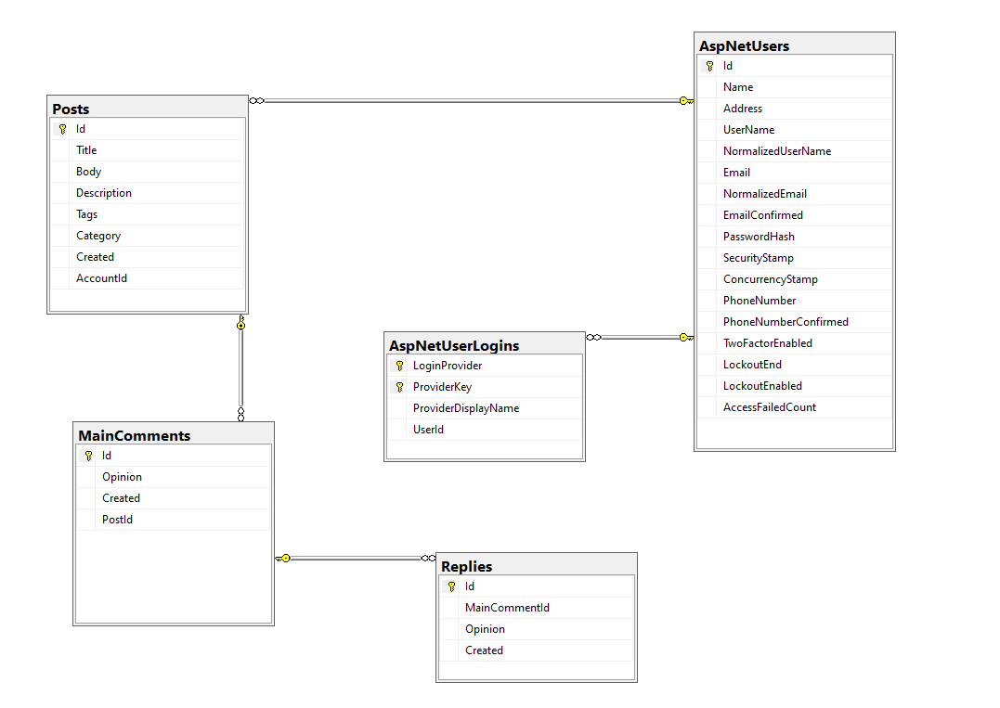

# Goal

Develop online blog page, where user can share opinions with others.

# User Experience

## User Stories

1. As a website owner I want to:
   - Create a database.
   - Manage access priviliges.
2. As a Login user I want to:
   - Write, update and delete my own posts.
   - Comment on posts.
3. As a guest I can:
   - Read posts. 
   - Search for an article.

## Design

- The UX is easy to understand and use
- The content of each page is centered in the middle.

# Database Design

# Existing Features

## Register

## Login

## Add Post

## Update/Delete Post

## Comment on a post

## Search posts

# Technologies

## Environments and Hosting

- [GitHub](https://github.com/) (Version control)
- [Local host] (Site host)

### Database

- [SQLServer](https://www.microsoft.com/en-us/sql-server/) (SQL database hosting)

# Development

### Fork

Any changes made to a forked repository do not affect the original repository.

- Log into GitHub and click on repository to download ([Blog](https://github.com/Nazek-Altayeb/blog))
- Click the **Fork** buttonin the top right-hand corner
- Select a different owner if necessary
- Click **Create Fork**
- The repo is now in your chosen account and can be cloned or changed

### Clone

Changes made to a cloned repository will affect the original one.

- Navigate to the main page of the repostitory (this could be a forked instance)
- Click on the **Code** dropdown menu above the list of files
- Choose a method to copy the URL for the repository: either via **HTTPS**, by using an **SSH key**, or by using **GitHub CLI**
- In your work environment, open Git Bash and change current directory to target location for cloned repository
- Type ``git clone`` followed by the copied URL and press enter **Enter**

### Download as ZIP

- Log into GitHub and click on repository to download ([Blog](https://github.com/Nazek-Altayeb/blog))
- Select **Code** and click "Download Zip" file
- Once download is completed, extract ZIP file and use in your local environment.

